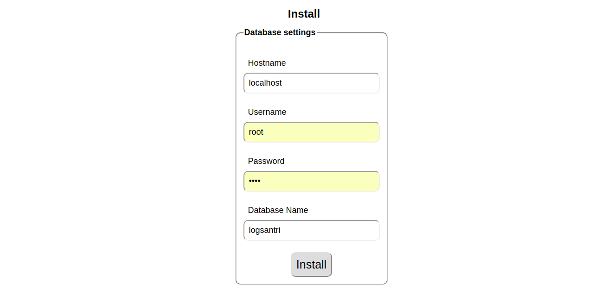
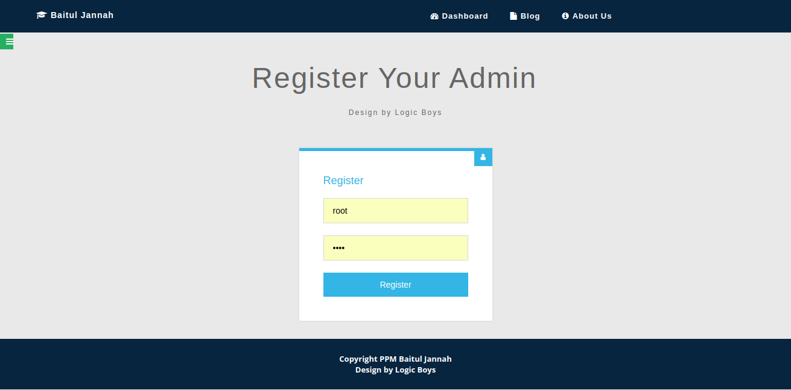
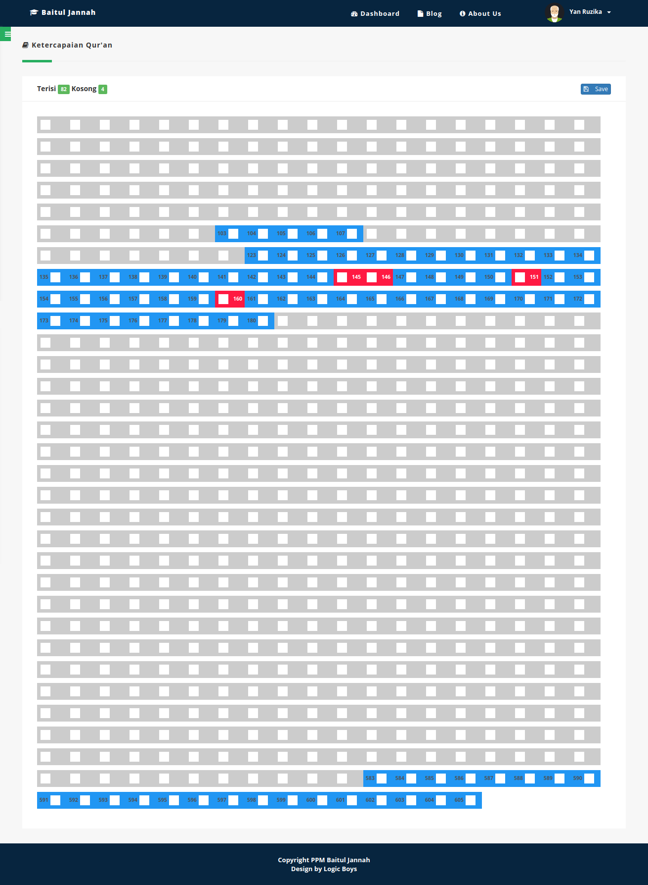

# Academy of Quran Information System
## Overview
Sistem Informasi yang dikhususkan untuk lembaga pendidikan berbasis pondok pesantren yang menitik beratkan pada pembelajaran makna, keterangan, dan tafsir Al-Qur'an dan Al-Hadist. Juga memfasilitasi tentang pendidikan karakter, kontrol ibadah, dan lain sebagainya untuk membentuk generasi yang unggul dengan tagline Profesional Religius.


## Purpose and Needs
Data merupakan sesuatu yang sangat tidak bisa dipungkiri merupakan sebuah kebutuhan untuk zaman ini. Semua lembaga diberbagai bidang memerlukan data, baik itu untuk arsip, analisis, maupun untuk kepentingan penyimpanan yang terus di update setiap hari.

Tak terkecuali untuk lembaga pendidikan yang harus terus berusaha untuk mengikuti perkembangan zaman sehingga tidak terlalu kuno dan bisa menelurkan bibit-bibit unggul. Lembaga ini juga membutuhkan manajemen data yang sangat rapi.

Daftar peserta didik? Bagaimana progresnya? Apakah ada yang melenceng dari target? Apakah tahun lalu dan tahun ini itu sama? Kalo tidak apa sih kendalanya?
Berbagai pertanyaan dan permasalahan diatas bisa diselesaikan dengan efektif dan efisien apabila lembaga itu bisa melakukan manajemen datanya dengan rapi.
## Getting Started
Sistem ini bisa dipasang baik di server lokal maupun secara online
### Prerequisites
1. [Apache Web Server](https://httpd.apache.org/download.cgi)
2. [MySQL Database Server](https://dev.mysql.com/downloads/installer)
3. [PHP](http://php.net/manual/en/install.general.php)

Jika tidak mau menginstall program diatas satu per satu, bisa menggunakan software milik bitnami yang bisa menginstall semuanya sekaligus, yaitu [XAMPP](https://www.apachefriends.org/index.html)
### Installation
Pertama pastikan XAMPP installer berjalan dengan baik

Download repository ini dengan fitur download di github kemudian extract di folder yang sudah anda tentukan sebagai root directory

Untuk Windows
```
C:/xampp/htdocs/direktori-anda
```
Untuk Linux bisa bermacam-macam tetapi umumnya pada
```
/var/www/direktori-anda
```
Setelah itu buka direktori yang menyimpan file tersebut dengan web browser dengan alamat installer
```
http://localhost/direktori-anda/install
```


Masukkan info host pada form yang ada
1. hostname: defaultnya adalah localhost
2. username: username dari mysql default adalah root
3. password: password dari mysql defaultnya adalah tidak ada
4. database name: nama database yang akan diisi



Setelah itu akan akan ada form untuk register admin username dan password. Admin ini berguna untuk mengatur seluruh dapukan dan regulasi akun lainnya.
## Usage
### Features
1. User access, beberapa akses yang bisa di dobel-dobel dengan beberapa fitur yang eksklusif di tiap akses

2. Tracking ketercapaian materi Qur'an dengan monitoring dari beberapa wali

3. Penilaian dari ketua kelompok yang bisa disebut dengan pasus

Untuk lebih lengkapnya bisa refer ke [Wiki]()

### Development setup
Untuk lebih lengkapnya bisa refer ke dokumentasi
### Notes

## Release History & Changelog
* 0.1.0
  * Initial Realease

## API Reference

* [PHP](http://php.net/manual/en/getting-started.php)
* [CodeIgniter](https://www.codeigniter.com/user_guide/)

## Contributor

